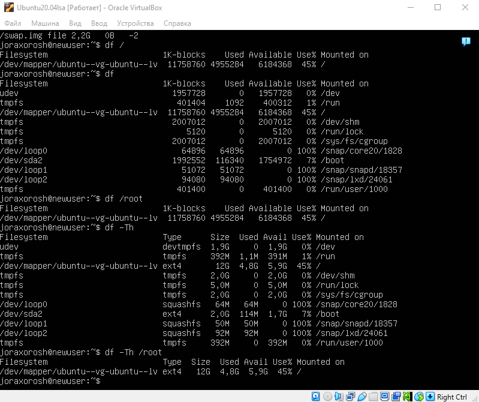
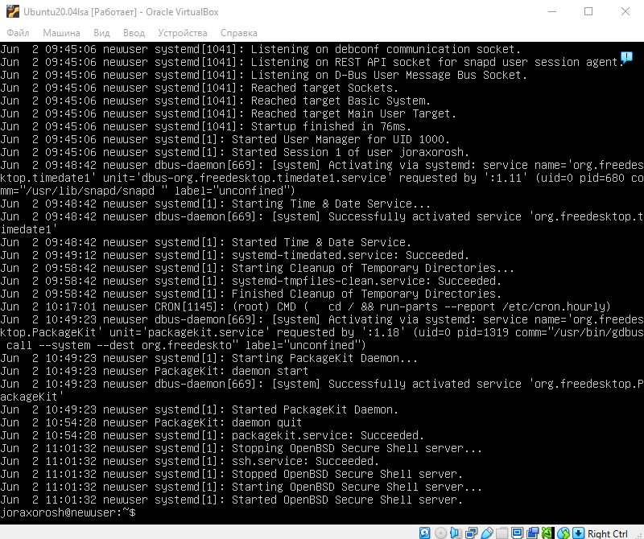

## Part 1. Установка ОС
- Вывод команды `cat /etc/issue`:  
  

## Part 2. Создание пользователя
- Создаём нового пользователся `new_user` командой `adduser`:  
  
- Добавляем нового пользователся в группу `adm` командой `usermod`:  
  
- Вывод команды `cat /etc/passwd`:  
  
- Проверка состоит ли новый пользователь в группе `adm`.   
Вывод команды `groups new_user`:  

## Part 3. Настройка сети ОС

- Задай название машины вида user-1.  
  
- Установи временную зону, соответствующую твоему текущему местоположению.  
  
- Выведи названия сетевых интерфейсов с помощью консольной команды.  
  
lo (loopback device) – виртуальный интерфейс, присутствующий по умолчанию в любом Linux. Он используется для отладки сетевых программ и запуска серверных приложений на локальной машине. С этим интерфейсом всегда связан адрес 127.0.0.1. У него есть dns-имя – localhost. Посмотреть привязку можно в файле /etc/hosts.   
- Используя консольную команду, получи ip адрес устройства, на котором ты работаешь, от DHCP-сервера.  
  
Вывод сетевых интерфейсов командой `ip a`. Адрес `10.0.2.15/24` получен от DHCP-сервера:  
**DHCP** (Dynamic Host Configuration Protocol Протокол динамической настройки узла) - это протокол, в соответствии с которым устройствам в сети автоматически выдаются IP-адреса и другая сетевая информация.  
- Определи и выведи на экран внешний ip-адрес шлюза (ip) и внутренний IP-адрес шлюза, он же ip-адрес по умолчанию (gw).  
  
Внешний ip-адрес: 89.22.142.113  
  
Внутренний ip-адрес: 10.0.2.2  
- Задай статичные (заданные вручную, а не полученные от DHCP-сервера) настройки ip, gw, dns (используй публичный DNS-серверы, например 1.1.1.1 или 8.8.8.8).  
  
  
- Перезагрузи виртуальную машину. Убедись, что статичные сетевые настройки (ip, gw, dns) соответствуют заданным в предыдущем пункте.  
  
Перезагрузил `sudo reboot`  
- Успешно пропингуй удаленные хосты 1.1.1.1 и ya.ru и вставь в отчёт скрин с выводом команды. В выводе команды должна быть фраза «0% packet loss».  

## Part 4. Обновление ОС
- Обнови системные пакеты до последней на момент выполнения задания версии.  
  
## Part 5. Использование команды sudo
- Разреши пользователю, созданному в [Part 2],выполнять команду sudo.  
  
- Поменяй hostname ОС от имени пользователя, созданного в пункте [Part 2]  
  
**sudo** (от **S**ubstitute **U**ser **do**, ) — это команда, позволяющая обычному пользователю временно выполнять команды от имени администратора (root). Она защищает систему от случайных или вредоносных действий и позволяет контролировать, кто и что может выполнять.

## Part 6. Установка и настройка службы времени
- Настрой службу автоматической синхронизации времени.    
- Выведи время часового пояса, в котором ты сейчас находишься.  
- Вывод следующей команды должен содержать `NTPSynchronized=yes`: \
  `timedatectl show`  
  
## Part 7. Установка и использование текстовых редакторов
- Установи текстовые редакторы **VIM** (+ любые два по желанию **NANO**, **MCEDIT**, **JOE** и т. д.)    
  

- Используя каждый из трех выбранных редакторов, создай файл *test_X.txt*, где X — название редактора, в котором создан файл. Напиши в нём свой никнейм, закрой файл с сохранением изменений.  
VIM:  
Создать файл sudo vim test_vim.txt  
  
NANO:  
Создать файл sudo nano test_vim.txt  
  
MCEDIT:  
Создать файл sudo mcedit test_vim.txt  
  
- В отчёте укажи, что сделал для выхода с сохранением изменений.  
vim выход: esc + :wq  
nano выход: ctrl+X + y + enter  
mcedit выход: F2 + F10  

- Используя каждый из трех выбранных редакторов, открой файл на редактирование, отредактируй файл, заменив никнейм на строку «21 School 21», закрой файл без сохранения изменений.  
VIM:  
  
NANO:  
  
MCEDIT:  
  
- В отчёте укажи, что сделал для выхода без сохранения изменений.  
vim выход :q!  
nano выход: ctrl + x + n  
mcedit выход: F10  

- Используя каждый из трех выбранных редакторов, отредактируй файл ещё раз (по аналогии с предыдущим пунктом), а затем освой функции поиска по содержимому файла (слово) и замены слова на любое другое. 
Из каждого редактора с результатами поиска слова. 
VIM поиск "/"  
  
NANO поиск - ctrl w  
  
mcedit поиск -f7, вводим запрос, и нажимаем find all  
  
- Из каждого редактора с командами, введёнными для замены слова на другое.  
vim замена ":%s:/старое слово/новое слово/g"    
  
nano замена - Ctrl + W для перехода к панели поиска, далее Ctrl + R 
nano Далее вводим слово на что хотим заменить, enter + Y  
  
mcedit замена - F4  

## Part 8. Установка и базовая настройка сервиса SSHD
- Установи службу SSHd.    
  
- Добавь автостарт службы при загрузке системы.   
   
- Перенастрой службу SSHd на порт 2022.   
   
- Используя команду ps, покажи наличие процесса sshd. Для этого к команде нужно подобрать ключи.  
   
- В отчёте объясни значение команды и каждого ключа в ней.   
Ключ **e** используется для вывода всех процессов, а **f** для расширения формата выводимой информации. grep выводит записи содержащие "sshd".  
- Перезагрузи систему.   
`sudo reboot` для перезагрузки виртуальной машины  

- Вывод команды netstat -tan должен содержать  \
`tcp 0 0 0.0.0.0:2022 0.0.0.0:* LISTEN`  \  
   
- В отчёте объясни значение ключей -tan, значение каждого столбца вывода, значение 0.0.0.0.   
`-t` показать только TCP-соединения,  `-a` показать все подключения (и прослушивание, и установленные)  `-n` показать IP-адреса и номера портов в числовом виде, без DNS-имен  

***Proto*** - протокол соединения   
***Recv-Q/Send-Q*** - кол-во полученных/отправленных байтов в очереди   
***Local Adress*** - локальный адрес и порт, где sshd слушает подключения  
***Foreign Adress*** - удалённый адрес  
***State*** - текущее состояние соединения  
**Значение 0.0.0.0.**: это «универсальный адрес» — SSH слушает на всех интерфейсах, т.е. доступен с любого IP-адреса машины

## Part 9. Установка и использование утилит top, htop
- По выводу команды top определи и напиши в отчёте:  
 
  - uptime - 9min
  - количество авторизованных пользователей - 1 user
  - среднюю загрузку системы - 0,00, 0,02, 0,01
  - общее количество процессов - 102 
  - загрузку cpu - 0%
  - загрузку памяти - Всего: 3919,9 МБ, Свободно: 3539,0 МБ, Использовано: 154,4 МБ, Кэш/буфер: 226,5 МБ,
  - pid процесса занимающего больше всего памяти - 1
  - pid процесса, занимающего больше всего процессорного времени - 174

- В отчёт вставь скрин с выводом команды htop:  
   
- отсортированному по PID, PERCENT_CPU, PERCENT_MEM, TIME;  
   
   
   
   
- отфильтрованному для процесса sshd;  
   
- с процессом syslog, найденным, используя поиск;  
   
- с добавленным выводом hostname, clock и uptime.   
   

## Part 10. Использование утилиты fdisk

- Запусти команду fdisk -l.  
 
- В отчёте напиши название жесткого диска, его размер и количество секторов, а также размер swap.  
***название жесткого диска***: /dev/sda   
***размер жесткого диска***: 25 GiB  
***количество секторов***: 52428800  
 
***размер swap***: 2,2 G  

## Part 11. Использование утилиты df

- Запусти команду df.   
 
- В отчёте напиши для корневого раздела (/):  
 
  - размер раздела - 11758760
  - размер занятого пространства - 4955284
  - размер свободного пространства - 6184368
  - процент использования - 45%
- Определи и напиши в отчёт единицу измерения в выводе.  
  - В выводе используются килобайты

- Запусти команду df -Th.  
 
- В отчёте напиши для корневого раздела (/):  
 
    - размер раздела - 12G
    - размер занятого пространства - 4,8G
    - размер свободного пространства - 5,9G
    - процент использования - 45%
- Определи и напиши в отчёт тип файловой системы для раздела.
ext4

## Part 12. Использование утилиты du
- Запусти команду du.  
 
- Выведи размер папок /home, /var, /var/log (в байтах, в человекочитаемом виде).  
 
 
- Выведи размер всего содержимого в /var/log (не общее, а каждого вложенного элемента, используя *).  
 

## Part 13. Установка и использование утилиты ncdu
- Установи утилиту ncdu.  
 
- Выведи размер папок /home, /var, /var/log.  
- `sudo ncdu /home`   
 
- `sudo ncdu /var`   
 
- `sudo ncdu /var/log`  
 

## Part 14. Работа с системными журналами

- Открой для просмотра:
- 1. /var/log/dmesg  
 
- 2. /var/log/syslog  
 
- 3. /var/log/auth.log   
  

- Напиши в отчёте время последней успешной авторизации, имя пользователя и метод входа в систему.  
  - Jun 2 10:52:34 newuser sudo  
- Перезапусти службу SSHd.  
 
- Вставь в отчёт скрин с сообщением о рестарте службы (искать в логах).  
 
## Part 15. Использование планировщика заданий CRON

- Используя планировщик заданий, запусти команду uptime через каждые 2 минуты.  
 
  - Найди в системных журналах строчки (минимум две в заданном временном диапазоне) о выполнении.  
   
  - Выведи на экран список текущих заданий для CRON.  
   

- Удали все задания из планировщика заданий.  
  