## Part 1. Инструмент **ipcalc**

**== Задание ==**

##### Подними виртуальную машину (далее -- ws1)

#### 1.1. Сети и маски
##### Определи и запиши в отчёт:
##### 1) Адрес сети *192.167.38.54/13*

- Введём команды `sudo apt install ipcalc` `ipcalc 192.167.38.54/13`

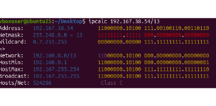

- Адрес сети в строке `Network` - `192.160.0.0/13`

##### 2) Перевод маски *255.255.255.0* в префиксную и двоичную запись, */15* в обычную и двоичную, *11111111.11111111.11111111.11110000* в обычную и префиксную

- Введём команду `ipcalc 255.255.255.0`

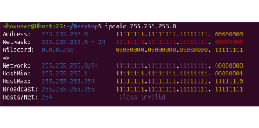

- Маска в префиксной форме `/24`, в двоичной `11111111.11111111.11111111.00000000`

- Введём команду `ipcalc 0.0.0.0/15`

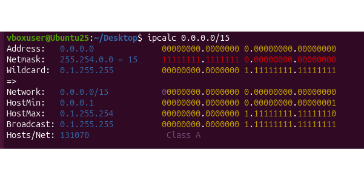

- В обычной: `255.254.0.0`
- В двоичной: `11111111.11111110.00000000.00000000`

- Введём команду `ipcalc 0.0.0.0/28`

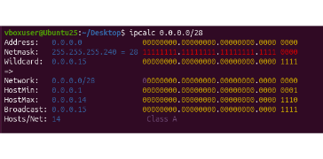

- В обычной: `255.255.255.240`
- В префиксной: `/28`

##### 3) Минимальный и максимальный хост в сети *12.167.38.4* при масках: */8*, *11111111.11111111.00000000.00000000*, *255.255.254.0* и */4*

- Минимальный и максимальный хост в сети 12.167.38.4 при маске /8:

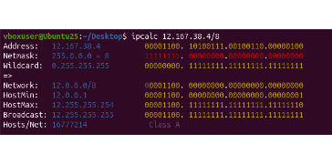

- Минимальный хост - `12.0.0.1`, максимальный - `12.255.255.254`

- Минимальный и максимальный хост в сети 12.167.38.4 при маске 11111111.11111111.00000000.00000000:

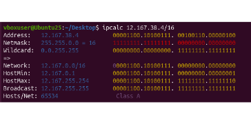

- Минимальный хост - `12.167.0.1`, максимальный - `12.167.255.254`

- Минимальный и максимальный хост в сети 12.167.38.4 при маске 255.255.254.0

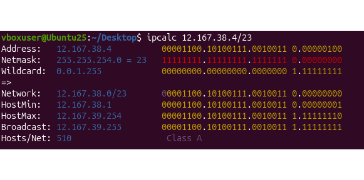

- Минимальный хост - `12.167.38.1`, максимальный - `12.167.39.254`

- Минимальный и максимальный хост в сети 12.167.38.4 при маске /4

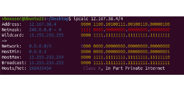

- Минимальный хост - `0.0.0.1`, максимальный - `15.255.255.254`

#### 1.2. localhost
##### Определи и запиши в отчёт, можно ли обратиться к приложению, работающему на localhost, со следующими IP: *194.34.23.100*, *127.0.0.2*, *127.1.0.1*, *128.0.0.1*

- Диапазон IP-адресов, доступных для обращения через интерфейс loopback, является стандартным и определён в спецификации `Internet Assigned Numbers Authority`.
- Этот диапазон адресов известен как `Loopback IP Address Range` и содержит адреса от `127.0.0.1` до `127.255.255.254`. Также это можно проверить через `ipcalc`.
- *Можно* обратиться к приложению на `localhost` через адреса `127.1.0.1` и `127.0.0.2`
- *Нельзя* обратиться через адреса `194.34.23.100` и `128.0.0.1`

#### 1.3. Диапазоны и сегменты сетей
##### Определи и запиши в отчёт:
##### 1) Какие из перечисленных IP можно использовать в качестве публичного, а какие только в качестве частных: *10.0.0.45*, *134.43.0.2*, *192.168.4.2*, *172.20.250.4*, *172.0.2.1*, *192.172.0.1*, *172.68.0.2*, *172.16.255.255*, *10.10.10.10*, *192.169.168.1*

- Публичные IP-адреса - это адреса, которые могут использоваться в Интернете и являются уникальными для каждого устройства в глобальной сети.
- Частные IP-адреса зарезервированы для использования в локальных сетях и не маршрутизируются через Интернет. Частные диапазоны:
    - 10.0.0.0 - 10.255.255.255 (10.0.0.0/8)
    - 100.64.0.0 — 100.127.255.255 (100.64.0.0/10)
    - 172.16.0.0 - 172.31.255.255 (172.16.0.0/12)
    - 192.168.0.0 - 192.168.255.255 (192.168.0.0/16)
- В качестве публичного: 134.43.0.2, 172.0.2.1, 192.172.0.1, 172.68.0.2, 192.169.168.1.
- В качестве частных: 10.0.0.45, 192.168.4.2, 172.20.250.4, 172.16.255.255, 10.10.10.10.

##### 2) Какие из перечисленных IP адресов шлюза возможны у сети *10.10.0.0/18*: *10.0.0.1*, *10.10.0.2*, *10.10.10.10*, *10.10.100.1*, *10.10.1.255*

- Шлюзу может принадлежать любой адрес из возможных хостов в подсети, то есть в данном случае любой из диапазона 10.10.0.1 - 10.10.63.254.

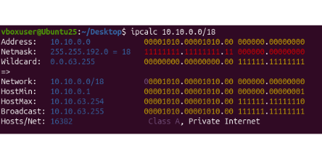

- *Возможные* адреса шлюза из предложенных: 10.10.0.2, 10.10.10.10, 10.10.1.255
- В качестве шлюза *не подходят*: 10.0.0.1, 10.10.100.1


## Part 2. Статическая маршрутизация между двумя машинами

**== Задание ==**

##### Подними две виртуальные машины (далее -- ws1 и ws2).

##### С помощью команды `ip a` посмотри существующие сетевые интерфейсы.
- В отчёт помести скрин с вызовом и выводом использованной команды.

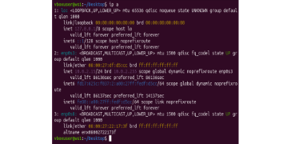
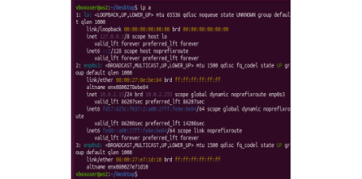

- На обеих машинах внутренней сети соответствует интерфейс `enp0s8`.
- `enp0s8` — имя конфигурационного сетевого интерфейса, сформированного из типа физического порта и порядкового номера. `en` - Ethernet, `p0` - PCI-устройство с 0 портов, `s8` - номер слота.
- lo или local loopback (локальная петля). Служит для подключения по сети к этому же компьютеру и не требует дополнительной настройки.
- enp0s3 — сетевой адаптер Ethernet (NAT), через него ВМ выходит в интернет.

##### Опиши сетевой интерфейс, соответствующий внутренней сети, на обеих машинах и задать следующие адреса и маски: ws1 - *192.168.100.10*, маска */16*, ws2 - *172.24.116.8*, маска */12*.
- В отчёт помести скрины с содержанием изменённого файла *etc/netplan/00-installer-config.yaml* для каждой машины.

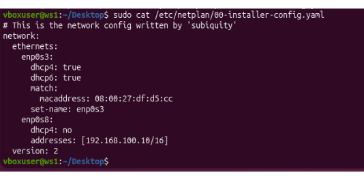
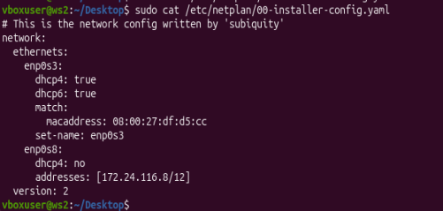

##### Выполни команду `netplan apply` для перезапуска сервиса сети.
- В отчёт помести скрин с вызовом и выводом использованной команды.

- На первом скриншоте результат выполнения команды `netplan apply` на ws1, на втором скриншоте — на ws2.

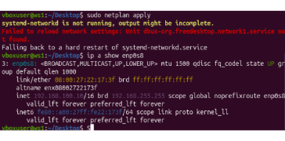
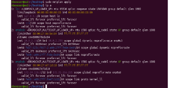


#### 2.1. Добавление статического маршрута вручную
##### Добавь статический маршрут от одной машины до другой и обратно при помощи команды вида `ip r add`.

```
sudo ip r add 172.24.116.8 dev enp0s8  //ws1
sudo ip r add 192.168.100.10 dev enp0s8 //ws2
```

##### Пропингуй соединение между машинами.
- В отчёт помести скрин с вызовом и выводом использованных команд.

```
ping -c 4 172.24.116.8 //ws1
ping -c 4 192.168.100.10 //ws2
```
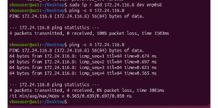
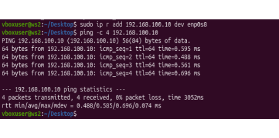

#### 2.2. Добавление статического маршрута с сохранением
##### Перезапусти машины.
##### Добавь статический маршрут от одной машины до другой с помощью файла *etc/netplan/00-installer-config.yaml*.
- В отчёт помести скрин с содержанием изменённого файла *etc/netplan/00-installer-config.yaml*.

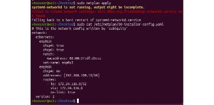
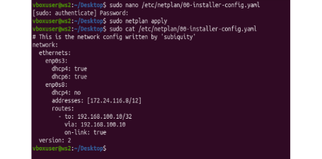

##### Пропингуй соединение между машинами.
- В отчёт помести скрин с вызовом и выводом использованной команды.

```
ping -c 4 172.24.116.8 //ws1
ping -c 4 192.168.100.10 //ws2
```

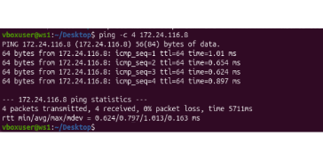
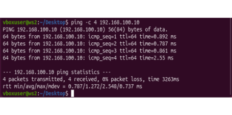


## Part 3. Утилита **iperf3**

**== Задание ==**

*В данном задании используются виртуальные машины ws1 и ws2 из Части 2*

#### 3.1. Скорость соединения
##### Переведи и запиши в отчёт: 8 Mbps в MB/s, 100 MB/s в Kbps, 1 Gbps в Mbps.

- 8 Mbps = 1 MB/s
- 100 MB/s = 819200 Kbps
- 1 Gbps = 1024 Mbps

- 8 Мегабит равен 1 Мегабайту, 100 Мегабайт равны 819200 килобитам, 1 Гигабит равен 1024 Мегабитам.

#### 3.2. Утилита **iperf3**
##### Измерь скорость соединения между ws1 и ws2.
- В отчёт помести скрины с вызовом и выводом использованных команд.

- Скорость соединения между ws1 и ws2:

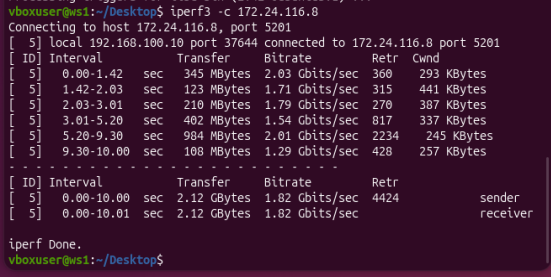
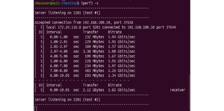


## Part 4. Сетевой экран

**== Задание ==**

*В данном задании используются виртуальные машины ws1 и ws2 из Части 2*

#### 4.1. Утилита **iptables**
##### Создай файл */etc/firewall.sh*, имитирующий файрвол, на ws1 и ws2:
```shell
#!/bin/sh

# Удаление всех правил в таблице «filter» (по-умолчанию).
iptables -F
iptables -X
```
##### Нужно добавить в файл подряд следующие правила:
##### 1) На ws1 примени стратегию, когда в начале пишется запрещающее правило, а в конце пишется разрешающее правило (это касается пунктов 4 и 5).
##### 2) На ws2 примени стратегию, когда в начале пишется разрешающее правило, а в конце пишется запрещающее правило (это касается пунктов 4 и 5).
##### 3) Открой на машинах доступ для порта 22 (ssh) и порта 80 (http).
##### 4) Запрети *echo reply* (машина не должна «пинговаться», т.е. должна быть блокировка на OUTPUT).
##### 5) Разреши *echo reply* (машина должна «пинговаться»).
- В отчёт помести скрины с содержанием файла */etc/firewall* для каждой машины.

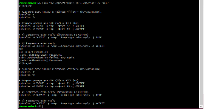
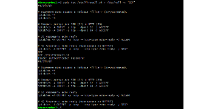

##### Запусти файлы на обеих машинах командами `chmod +x /etc/firewall.sh` и `/etc/firewall.sh`.
- В отчёт помести скрины с запуском обоих файлов.

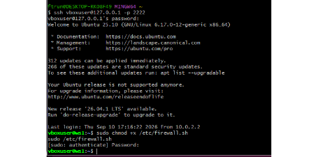
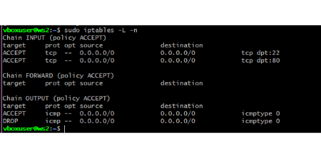

- В отчёте опиши разницу между стратегиями, применёнными в первом и втором файлах.

- Правила выполняются сверху вниз, следовательно, если правило запрета находится выше, оно срабатывает, а правило разрешения, находящееся ниже — нет.
- На ws1 запрет echo-reply стоит первым, поэтому машина не пингуется.
- На ws2 разрешение echo-reply стоит первым, поэтому машина пингуется.

#### 4.2. Утилита **nmap**
##### Командой **ping** найди машину, которая не «пингуется», после чего утилитой **nmap** покажи, что хост машины запущен.
*Проверка: в выводе nmap должно быть сказано: `Host is up`*.
- В отчёт помести скрины с вызовом и выводом использованных команд **ping** и **nmap**.

- С ws2 пингуем ws1 — соединение не устанавливается:

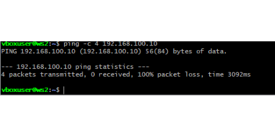

- Проверяем через nmap, что хост ws1 всё же запущен:

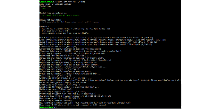

##### Сохрани дампы образов виртуальных машин


## Part 5. Статическая маршрутизация сети

**== Задание ==**

Сеть:


##### Подними пять виртуальных машин (3 рабочие станции (ws11, ws21, ws22) и 2 роутера (r1, r2)).

#### 5.1. Настройка адресов машин
##### Настрой конфигурации машин в *etc/netplan/00-installer-config.yaml* согласно сети на рисунке.
- В отчёт помести скрины с содержанием файла *etc/netplan/00-installer-config.yaml* для каждой машины.

`R1:`

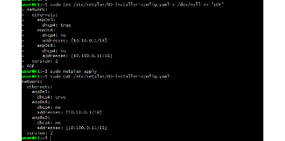

`R2:`

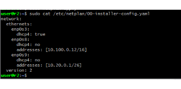

`WS11:`

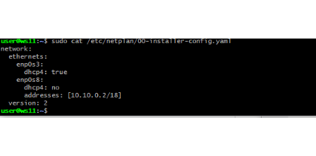

`WS21:`

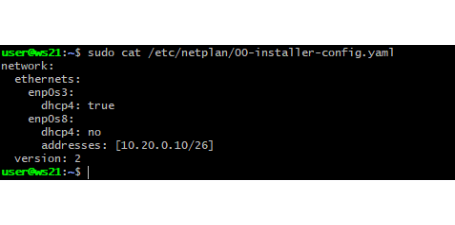

`WS22:`


##### Перезапусти сервис сети. Если ошибок нет, командой `ip -4 a` проверь, что адрес машины задан верно. Также пропингуй ws22 с ws21. Аналогично пропингуй r1 с ws11.
- В отчёт помести скрины с вызовом и выводом использованных команд.

- Проверяем командой `ip -4 a` корректность настроек:

`R1:`

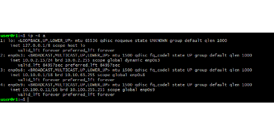

`R2:`

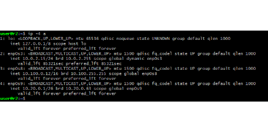

`WS11:`

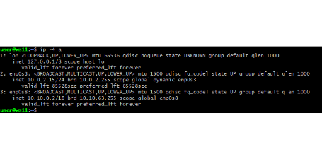

`WS21:`

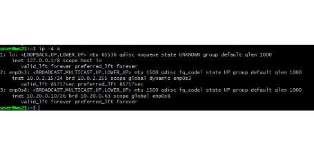

`WS22:`

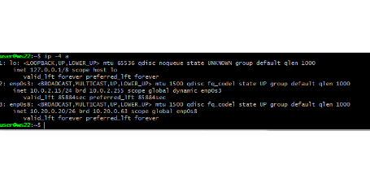

`WS21 c WS22:`

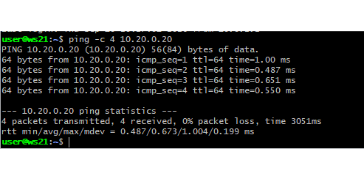

`R1 c WS11:`

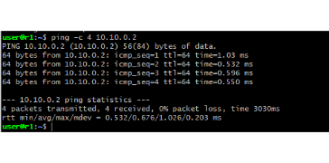

#### 5.2. Включение переадресации IP-адресов
##### Для включения переадресации IP выполни команду на роутерах:
`sysctl -w net.ipv4.ip_forward=1`
*При таком подходе переадресация не будет работать после перезагрузки системы.*
- В отчёт помести скрин с вызовом и выводом использованной команды.

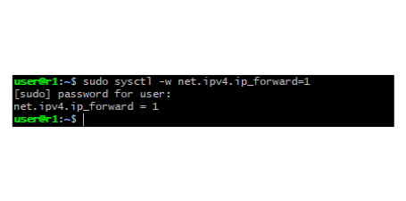
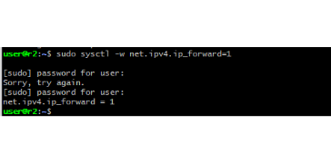

##### Открой файл */etc/sysctl.conf* и добавь в него следующую строку:
`net.ipv4.ip_forward = 1`
*При использовании этого подхода, IP-переадресация включена на постоянной основе.*
- В отчёт помести скрин с содержанием изменённого файла */etc/sysctl.conf*.

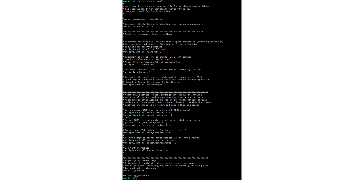

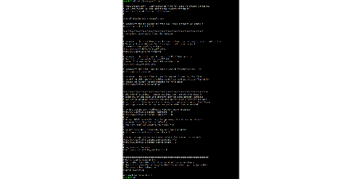

#### 5.3. Установка маршрута по умолчанию
Пример вывода команды `ip r` после добавления шлюза:
```
default via 10.10.0.1 dev eth0
10.10.0.0/18 dev eth0 proto kernel scope link src 10.10.0.2
```
##### Настрой маршрут по умолчанию (шлюз) для рабочих станций. Для этого добавь `default` перед IP роутера в файле конфигураций.
- В отчёт помести скрин с содержанием файла *etc/netplan/00-installer-config.yaml*;

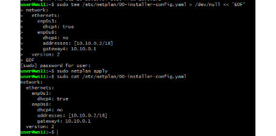
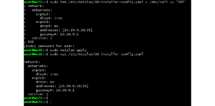
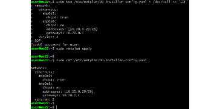

##### Вызови `ip r` и покажи, что добавился маршрут в таблицу маршрутизации.
- В отчёт помести скрин с вызовом и выводом использованной команды.

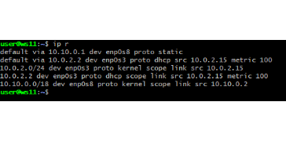
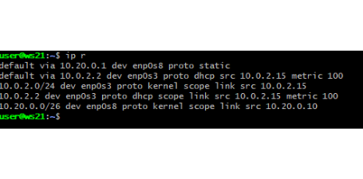
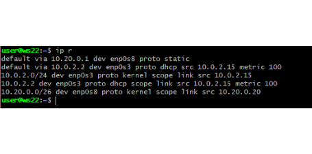

##### Пропингуй с ws11 роутер r2 и покажи на r2, что пинг доходит. Для этого используй команду:
`tcpdump -tn -i eth0`
- В отчёт помести скрин с вызовом и выводом использованных команд.


- Пинг на ws11 показывает, что пакеты не доставлены.
- Но `tcpdump -tn -i enp0s8` на r2 говорит об обратном — ICMP echo request от ws11 (10.10.0.2) доходят до r2.
- Ответ не возвращается обратно на ws11, так как у r2 ещё нет обратного маршрута до сети 10.10.0.0/18.

#### 5.4. Добавление статических маршрутов
##### Добавь в роутеры r1 и r2 статические маршруты в файле конфигураций. Пример для r1 маршрута в сетку 10.20.0.0/26:
```shell
# Добавь в конец описания сетевого интерфейса eth1:
- to: 10.20.0.0/26
  via: 10.100.0.12
```
- В отчёт помести скрины с содержанием изменённого файла *etc/netplan/00-installer-config.yaml* для каждого роутера.


##### Вызови `ip r` и покажи таблицы с маршрутами на обоих роутерах. Пример таблицы на r1:
```
10.100.0.0/16 dev eth1 proto kernel scope link src 10.100.0.11
10.20.0.0/26 via 10.100.0.12 dev eth1
10.10.0.0/18 dev eth0 proto kernel scope link src 10.10.0.1
```
- В отчёт помести скрин с вызовом и выводом использованной команды.


##### Запусти команды на ws11:
`ip r list 10.10.0.0/[маска сети]` и `ip r list 0.0.0.0/0`
- В отчёт помести скрин с вызовом и выводом использованных команд;


- В отчёте объясни, почему для адреса 10.10.0.0/\[маска сети\] был выбран маршрут, отличный от 0.0.0.0/0, хотя он попадает под маршрут по-умолчанию.

- Для адреса 10.10.0.0/18 был выбран маршрут, отличный от 0.0.0.0/0, потому что при наличии нескольких подходящих маршрутов ядро Linux выбирает наиболее точный (маршрут с самой длинной маской, longest prefix match).
- Маршрут 10.10.0.0/18 указывает сеть точнее, чем общий маршрут по умолчанию 0.0.0.0/0.

#### 5.5. Построение списка маршрутизаторов
Пример вывода утилиты **traceroute** после добавления шлюза:
```
1 10.10.0.1 0 ms 1 ms 0 ms
2 10.100.0.12 1 ms 0 ms 1 ms
3 10.20.0.10 12 ms 1 ms 3 ms
```
##### Запусти на r1 команду дампа:
`tcpdump -tnv -i eth0`
##### При помощи утилиты **traceroute** построй список маршрутизаторов на пути от ws11 до ws21.
- В отчёт помести скрины с вызовом и выводом использованных команд (tcpdump и traceroute);


- В отчёте, опираясь на вывод, полученный из дампа на r1, объясни принцип работы построения пути при помощи **traceroute**.

- Утилита traceroute вместо ICMP-запроса отправляет UDP-пакеты на определённый порт целевого хоста и ожидает ответа о недоступности этого порта.
- Первый пакет отправляется с TTL=1, второй с TTL=2 и так далее, пока запрос не попадёт адресату.
- Когда TTL пакета обнуляется на очередном маршрутизаторе, тот отправляет обратно ICMP-сообщение "Time Exceeded", которое traceroute использует, чтобы узнать адрес этого маршрутизатора и время отклика.
- Когда пакет наконец достигает хоста назначения, тот отвечает ICMP-сообщением "Destination port unreachable" (порт назначения недоступен), поскольку изначально порт был выбран заведомо закрытым — это служит сигналом того, что трассировка завершена.

#### 5.6. Использование протокола **ICMP** при маршрутизации
##### Запусти на r1 перехват сетевого трафика, проходящего через eth0 с помощью команды:
`tcpdump -n -i eth0 icmp`
##### Пропингуй с ws11 несуществующий IP (например, *10.30.0.111*) с помощью команды:
`ping -c 1 10.30.0.111`
- В отчёт помести скрин с вызовом и выводом использованных команд.


- Пинг показывает 100% потерь (адрес не существует).
- Но в дампе на r1 видно сам ICMP echo request от ws11 (10.10.0.2) в сторону 10.30.0.111 — маршрутизатор успешно принял и попытался передать пакет дальше, просто ответа от несуществующего хоста, разумеется, не последовало.

##### Сохрани дампы образов виртуальных машин.


## Part 6. Динамическая настройка IP с помощью **DHCP**

**== Задание ==**

*В данном задании используются виртуальные машины из Части 5.*

##### Для r2 настрой в файле */etc/dhcp/dhcpd.conf* конфигурацию службы **DHCP**:
##### 1) Укажи адрес маршрутизатора по-умолчанию, DNS-сервер и адрес внутренней сети. Пример файла для r2:
```shell
subnet 10.100.0.0 netmask 255.255.0.0 {}

subnet 10.20.0.0 netmask 255.255.255.192
{
    range 10.20.0.2 10.20.0.50;
    option routers 10.20.0.1;
    option domain-name-servers 10.20.0.1;
}
```


##### 2) В файле *resolv.conf* пропиши `nameserver 8.8.8.8`.
- В отчёт помести скрины с содержанием изменённых файлов.


##### Перезагрузи службу **DHCP** командой `systemctl restart isc-dhcp-server`. Машину ws21 перезагрузи при помощи `reboot` и через `ip a` покажи, что она получила адрес. Также пропингуй ws22 с ws21.
- В отчёт помести скрины с вызовом и выводом использованных команд.


##### Укажи MAC адрес у ws11, для этого в *etc/netplan/00-installer-config.yaml* надо добавить строки: `macaddress: 10:10:10:10:10:BA`, `dhcp4: true`.
- В отчёт помести скрин с содержанием изменённого файла *etc/netplan/00-installer-config.yaml*.


##### Для r1 настрой аналогично r2, но сделай выдачу адресов с жесткой привязкой к MAC-адресу (ws11). Проведи аналогичные тесты.
- В отчёте этот пункт опиши аналогично настройке для r2.

- Настроен `/etc/dhcp/dhcpd.conf` на r1 с фиксированной привязкой адреса `10.10.0.2` к MAC-адресу ws11 (`10:10:10:10:10:ba`) через секцию `host`:


- После перезапуска `isc-dhcp-server` на r1 и получения ws11 нового адреса по DHCP — в логе видно назначение фиксированного адреса именно этому MAC-адресу:


##### Запроси с ws21 обновление ip адреса.
- В отчёте помести скрины ip до и после обновления.

- Адрес ws21 до запроса на обновление:


- Запрос на обновление (`dhclient -v`) и адрес после:


- В отчёте опиши, какими опциями **DHCP** сервера пользовался в данном пункте.

- Опция `option routers [ip-address]` указывает на IP-адрес шлюза по умолчанию в сети — маршрутизаторы должны быть перечислены в порядке предпочтительности.
- Опция `option domain-name-servers [ip-address]` указывает на IP-адрес(а) DNS-сервера(ов), доступных клиенту.
- Также использовался `range` — диапазон адресов, которые сервер может динамически выдавать клиентам.
- Секция `host` с `hardware ethernet` и `fixed-address` — для жёсткой привязки конкретного адреса к конкретному MAC-адресу клиента (использовано для ws11 на r1).

##### Сохрани дампы образов виртуальных машин.
**P.S. Ни в коем случае не сохраняй дампы в гит!**


## Part 7. **NAT**

**== Задание ==**

*В данном задании используются виртуальные машины из Части 5.*
##### В файле */etc/apache2/ports.conf* на ws22 и r1 измени строку `Listen 80` на `Listen 0.0.0.0:80`, то есть сделай сервер Apache2 общедоступным.
- В отчёт помести скрин с содержанием изменённого файла.


##### Запусти веб-сервер Apache командой `service apache2 start` на ws22 и r1.
- В отчёт помести скрины с вызовом и выводом использованной команды.


##### Добавь в фаервол, созданный по аналогии с фаерволом из Части 4, на r2 следующие правила:
##### 1) Удаление правил в таблице filter - `iptables -F`;
##### 2) Удаление правил в таблице "NAT" - `iptables -F -t nat`;
##### 3) Отбрасывать все маршрутизируемые пакеты - `iptables --policy FORWARD DROP`.
##### Запусти файл также, как в Части 4.
##### Проверь соединение между ws22 и r1 командой `ping`.
*При запуске файла с этими правилами, ws22 не должна «пинговаться» с r1.*
- В отчёт помести скрины с вызовом и выводом использованной команды.


- Запустим `firewall.sh`:


- Пингуем ws22 с r1 - соединение не установлено:


##### Добавь в файл ещё одно правило:
##### 4) Разрешить маршрутизацию всех пакетов протокола **ICMP**.
##### Запусти файл также, как в Части 4.
##### Проверь соединение между ws22 и r1 командой `ping`.
*При запуске файла с этими правилами, ws22 должна «пинговаться» с r1.*
- В отчёт помести скрины с вызовом и выводом использованной команды.


- Пинг проходит:


##### Добавь в файл ещё два правила:
##### 5) Включи **SNAT**, а именно маскирование всех локальных ip из локальной сети, находящейся за r2 (по обозначениям из Части 5 - сеть 10.20.0.0).
*Совет: стоит подумать о маршрутизации внутренних пакетов, а также внешних пакетов с установленным соединением.*
##### 6) Включи **DNAT** на 8080 порт машины r2 и добавить к веб-серверу Apache, запущенному на ws22, доступ извне сети.
*Совет: стоит учесть, что при попытке подключения возникнет новое tcp-соединение, предназначенное ws22 и 80 порту.*
- В отчёт помести скрин с содержанием изменённого файла.


##### Запусти файл также, как в Части 4.
*Перед тестированием рекомендуется отключить сетевой интерфейс **NAT** (его наличие можно проверить командой `ip a`) в VirtualBox, если он включен.*

- Проверяем применённые правила таблицы NAT:


- Внутренние сети проекта (10.10.0.0/18, 10.100.0.0/16, 10.20.0.0/26) не пересекаются со стандартным диапазоном VirtualBox NAT (10.0.2.0/24), поэтому отключать NAT-интерфейс не потребовалось — он не мешает тестам SNAT/DNAT.

##### Проверь соединение по TCP для **SNAT**: для этого с ws22 подключиться к серверу Apache на r1 командой:
`telnet [адрес] [порт]`
##### Проверь соединение по TCP для **DNAT**: для этого с r1 подключиться к серверу Apache на ws22 командой `telnet` (обращаться по адресу r2 и порту 8080).
- В отчёт помести скрины с вызовом и выводом использованных команд.

- Проверяем соединение ws22 с r1 (`telnet 10.100.0.11 80`):


- Соединение r1 с ws22, обращаясь по адресу r2 и порту 8080 (`telnet 10.100.0.12 8080`):


##### Сохрани дампы образов виртуальных машин.
**P.S. Ни в коем случае не сохраняй дампы в гит!**


## Part 8. Дополнительно. Знакомство с **SSH Tunnels**

**== Задание ==**

*В данном задании используются виртуальные машины из Части 5.*

##### Запусти на r2 фаервол с правилами из Части 7.


##### Запусти веб-сервер **Apache** на ws22 только на localhost (то есть в файле */etc/apache2/ports.conf* измени строку `Listen 80` на `Listen localhost:80`).


##### Воспользуйся *Local TCP forwarding* с ws21 до ws22, чтобы получить доступ к веб-серверу на ws22 с ws21.

- Используем `Local TCP forwarding` для получения доступа к веб-серверу на ws22 с ws21 с помощью команды `ssh -L 9999:localhost:80 user@10.20.0.20`.
- Порт 9999 на ws21 пробрасывается на `localhost:80` со стороны ws22 (то есть на её собственный Apache).


##### Воспользуйся *Remote TCP forwarding* c ws11 до ws22, чтобы получить доступ к веб-серверу на ws22 с ws11.

- `Remote TCP forwarding` c ws11 до ws22 подразумевает, что ssh-соединение должно быть установлено в обратном направлении — от ws22 к ws11.
- Поэтому на ws22 выполняется подключение с помощью `ssh -R 8888:localhost:80 user@10.10.0.2`.
- Порт 8888 открывается на стороне ws11 и пробрасывается обратно на `localhost:80` со стороны ws22.


##### Для проверки, сработало ли подключение в обоих предыдущих пунктах, перейди во второй терминал (например, клавишами Alt + F2) и выполни команду:
`telnet 127.0.0.1 [локальный порт]`
- В отчёте опиши команды, необходимые для выполнения этих четырёх пунктов, а также приложи скриншоты с их вызовом и выводом.

- Проверяем подключение: открываем вторую сессию на ws21 и вводим команду `telnet 127.0.0.1 9999`:


- Открываем вторую сессию на ws11 и вводим команду `telnet 127.0.0.1 8888`:


##### Сохрани дампы образов виртуальных машин.
**P.S. Ни в коем случае не сохраняй дампы в гит!**
