# Отчёт по проекту Simple Docker

## Part 1. Готовый докер

- Скачан официальный образ `nginx` командой `docker pull nginx`.
- Проверено наличие образа командой `docker images`.
- Запущен контейнер командой `docker run -d nginx`.
- Проверен запуск контейнера командой `docker ps`.
- Получена информация о контейнере командой `docker inspect [container_id]`.
- Из вывода `docker inspect` определены:
  - размер контейнера: `SizeRw` = 81920 байт (80 KB, RW-слой контейнера), `SizeRootFs` = 183496704 байт (≈175 MB, с учётом базового образа nginx);
  - список замапленных портов: `80/tcp` объявлен в образе (`ExposedPorts`), но не замаплен на локальную машину (`PortBindings` пуст, контейнер запущен без `-p`);
  - IP-адрес контейнера: `172.17.0.2` (сеть `bridge`).
- Контейнер остановлен командой `docker stop [container_id]`.
- Проверена остановка контейнера командой `docker ps`.
- Запущен контейнер с портами 80 и 443, замапленными на локальную машину: `docker run -d -p 80:80 -p 443:443 nginx`.
- Проверена доступность стартовой страницы nginx по адресу `localhost:80`.
- Контейнер перезапущен командой `docker restart [container_id]`.
- Проверен повторный запуск контейнера.

**Скриншоты:**

- 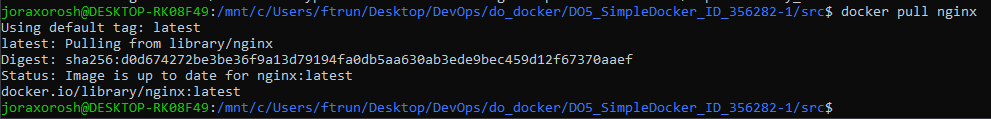
- 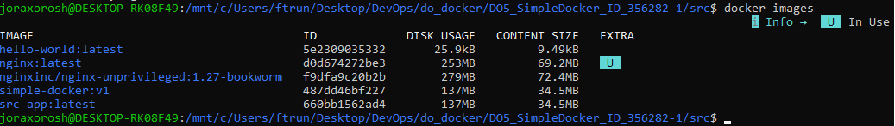
- 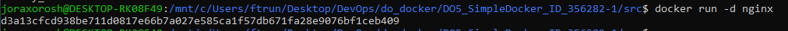
- 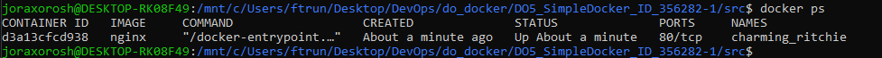
- 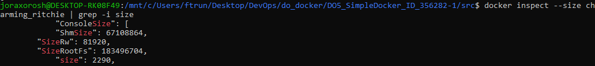
- 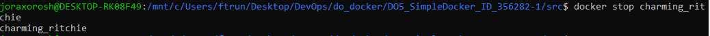
- 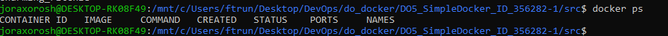
- 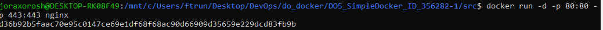
- 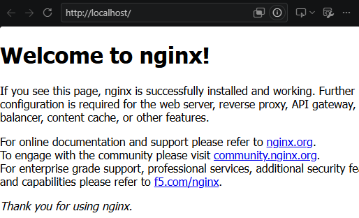
- 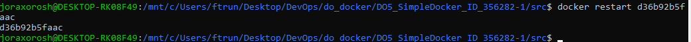
- 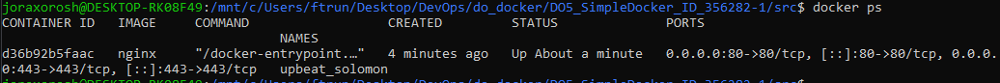

## Part 2. Операции с контейнером

- Прочитан конфигурационный файл `nginx.conf` внутри контейнера командой `docker exec [container_id] cat /etc/nginx/nginx.conf`.
- На локальной машине создан файл `nginx.conf` с блоком `location /status { stub_status on; }`.
- Файл скопирован внутрь контейнера командой `docker cp nginx.conf [container_id]:/etc/nginx/nginx.conf`.
- nginx перезапущен внутри контейнера командой `docker exec [container_id] nginx -s reload`.
- Проверена отдача страницы статуса по адресу `localhost:80/status`.
- Контейнер экспортирован в файл `container.tar` командой `docker export [container_id] -o container.tar`.
- Контейнер остановлен.
- Предпринята попытка удалить образ командой `docker rmi nginx` без удаления контейнеров — Docker отказал с ошибкой `conflict: unable to delete ... (must be forced) - container ... is using its referenced image`, так как остановленные контейнеры всё ещё ссылались на образ.
- Остановленные контейнеры (`charming_ritchie`, `upbeat_solomon`) удалены командой `docker rm`, после чего образ успешно удалён повторной командой `docker rmi nginx`.
- Из файла `container.tar` создан образ командой `docker import container.tar my-nginx:from-tar`.
- Создан и запущен контейнер на основе импортированного образа.
- Проверена отдача страницы статуса по адресу `localhost:80/status` в новом контейнере.

**Скриншоты:**

- 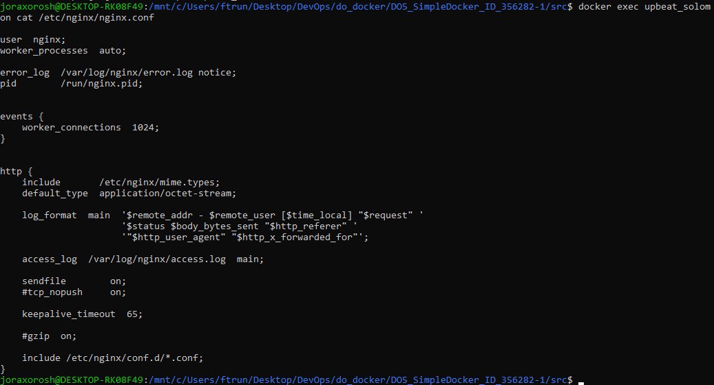
- 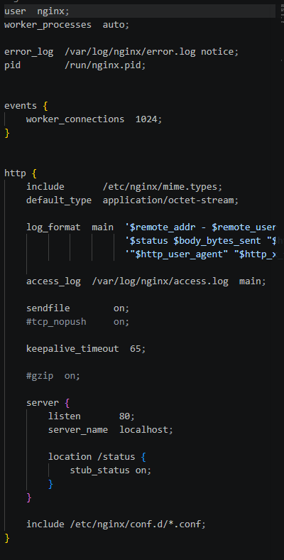
- 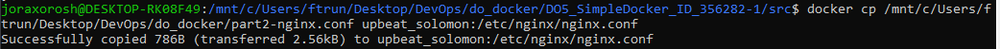
- 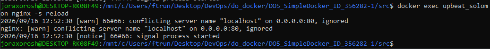
- 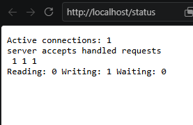
- 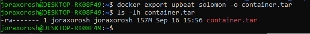
- 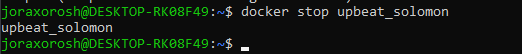
- 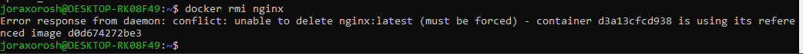
- 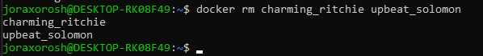
- 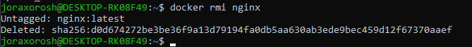
- 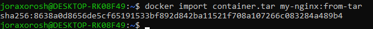
- 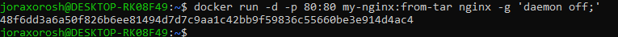
- 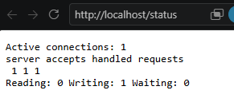

## Part 3. Мини веб-сервер

- Мини-сервер на C и FastCGI написан в [src/server/main.c](server/main.c), собирается через [src/server/Makefile](server/Makefile).
- Сервер запускается через `spawn-fcgi -a 127.0.0.1 -p 8080 -- ./server`.
- Конфигурация [src/nginx/nginx.conf](nginx/nginx.conf) проксирует запросы с порта 81 на `127.0.0.1:8080`.
- nginx с этой конфигурацией запускается локально командой `nginx -c $(pwd)/nginx.conf -p $(pwd)`.
- Проверена отдача страницы `Hello, World!` по адресу `localhost:81`.

**Скриншоты:**

- 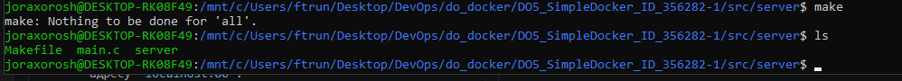
- 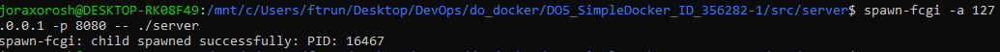
- 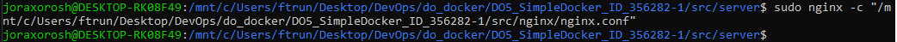
- 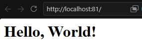

## Part 4. Свой докер

- Написан [src/Dockerfile](Dockerfile), который:
  - собирает исходники мини-сервера из Part 3 в отдельном build-стейдже (`debian:bookworm-slim` + `gcc`/`make`/`libfcgi-dev`);
  - в финальном стейдже (`debian:bookworm-slim` + `nginx`, `spawn-fcgi`) копирует бинарник сервера и `nginx.conf`;
  - запускает сервер через `spawn-fcgi` на порту 8080 и nginx на порту 81 инструкцией `CMD`;
  - работает от непривилегированного пользователя `www-data`.
- Образ собран командой (из папки `src`) `docker build -t simple-docker:v1 .`.
- Через `docker images` проверено, что образ собрался корректно.
- Образ запущен командой (из папки `src`):
  `docker run -d -p 80:81 -v $(pwd)/nginx:/etc/nginx simple-docker:v1`.
- Проверена доступность страницы мини-сервера по адресу `localhost:80`.
- В `nginx.conf` добавлен `location /status { stub_status on; }`.
- Образ пересобран, проверено автоматическое обновление конфигурации при перезапуске контейнера (конфиг подключён как volume).
- Проверена отдача страницы статуса по адресу `localhost:80/status`.

**Скриншоты:**

- 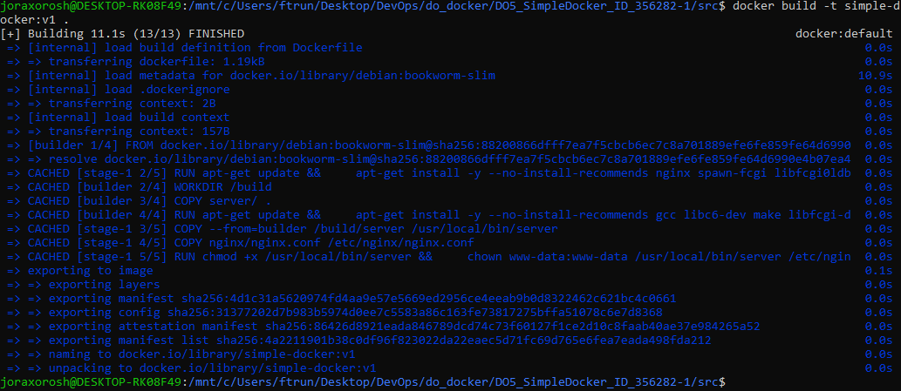
- 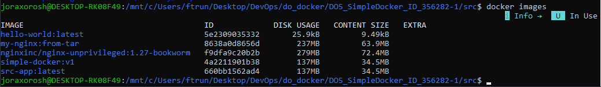
- 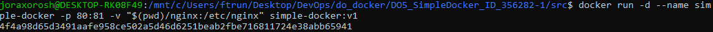
- 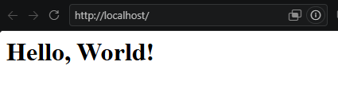
- 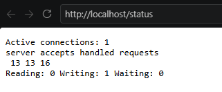

## Part 5. Dockle

- Образ из Part 4 просканирован командой `dockle simple-docker:v1`.
- Первое сканирование показало `FATAL CIS-DI-0010` ("credential in environment variables") — ложное срабатывание на слое официального образа `nginx`/`nginx-unprivileged`, где в скрипте загрузки GPG-ключей встречается переменная `NGINX_GPGKEYS`.
- Чтобы избавиться от этого слоя, Dockerfile переписан: финальный стейдж собран на чистом `debian:bookworm-slim` с установкой `nginx` через `apt`, а не на основе официального docker-образа nginx.
- Дополнительно добавлены: непривилегированный пользователь `www-data`, `HEALTHCHECK`, зафиксированные версии базовых образов, удаление кешей пакетного менеджера.
- После доработки повторное сканирование `dockle simple-docker:v1` (в т. ч. с `--exit-level warn`, код возврата `0`) не выдаёт ни одной ошибки (`FATAL`) и ни одного предупреждения (`WARN`) — остаются только два `INFO`-пункта (Content Trust и стандартные setuid/setgid-бинарники Debian), которые не относятся к ошибкам/предупреждениям.

**Скриншоты:**

- 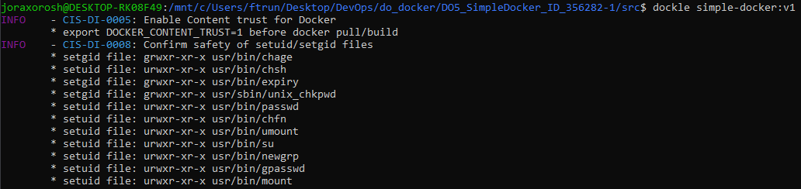

## Part 6. Базовый Docker Compose

- Написан [src/docker-compose.yml](docker-compose.yml), поднимающий два сервиса:
  - `app` — контейнер из Part 5, работает только во внутренней docker-сети (без `EXPOSE` и без маппинга портов на локальную машину);
  - `proxy` — контейнер с nginx ([src/nginx-proxy/nginx.conf](nginx-proxy/nginx.conf)), проксирующий запросы с порта 8080 на порт 81 сервиса `app`, порт 8080 которого замаплен на 80 порт локальной машины.
- Все ранее запущенные контейнеры остановлены.
- Проект собран и запущен командами `docker compose build` и `docker compose up`.
- Проверена отдача страницы мини-сервера по адресу `localhost:80`.

**Скриншоты:**

- 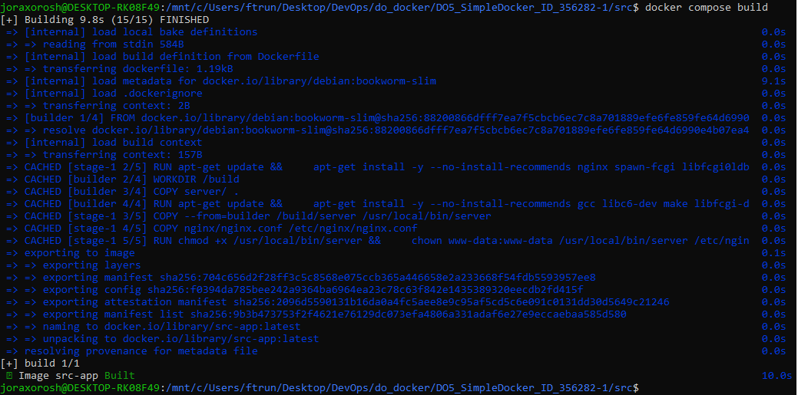
- 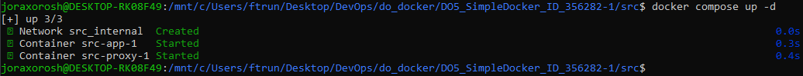
- 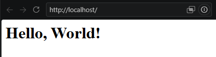
